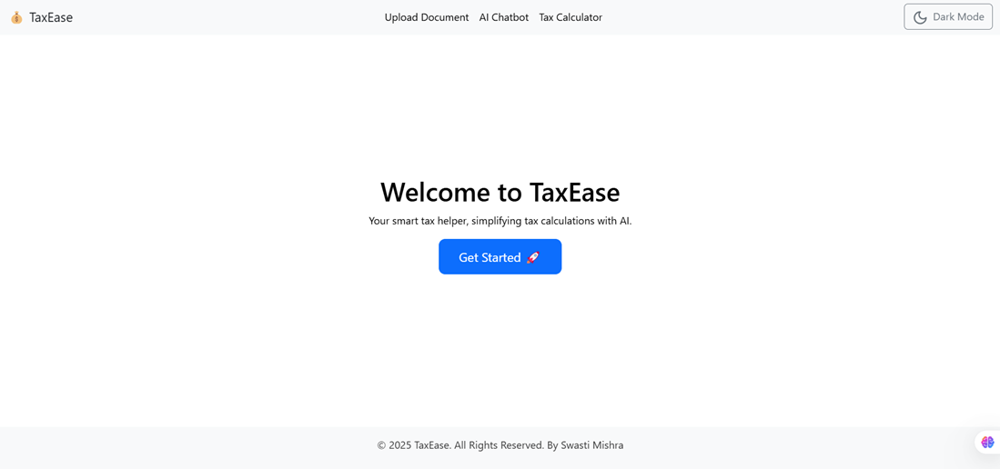
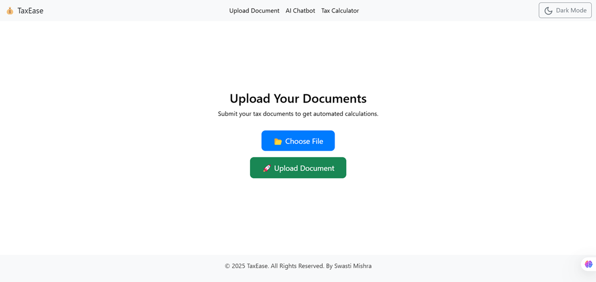
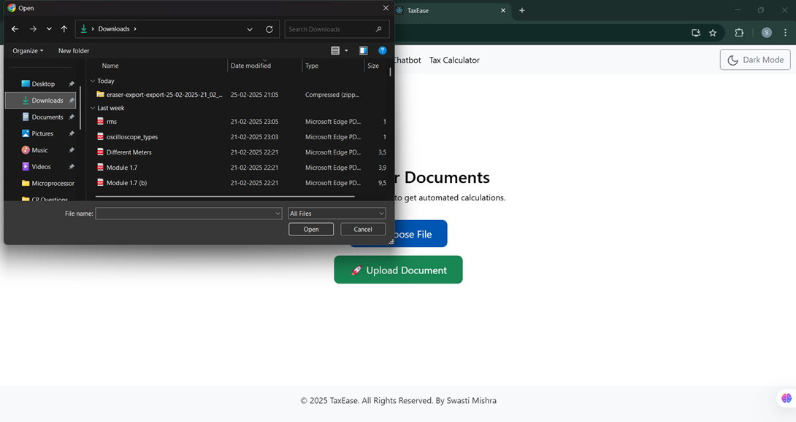
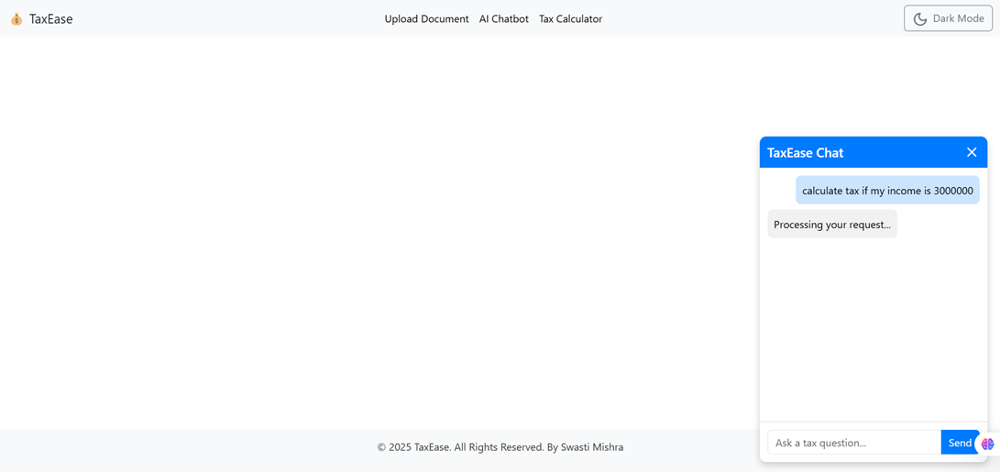
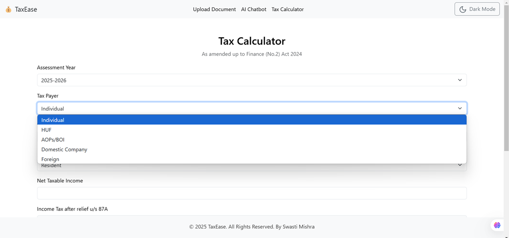
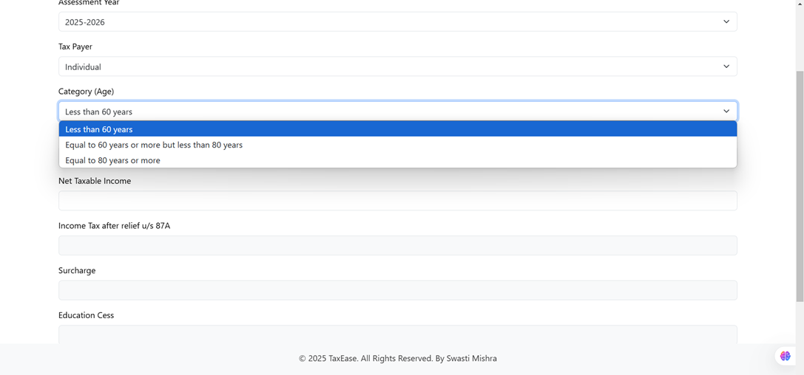
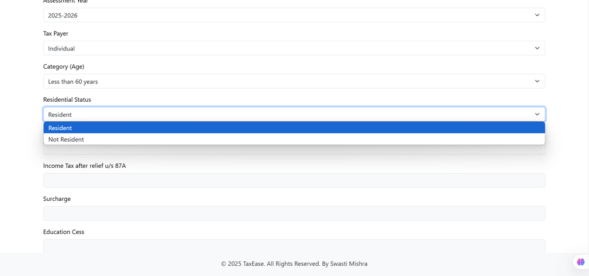
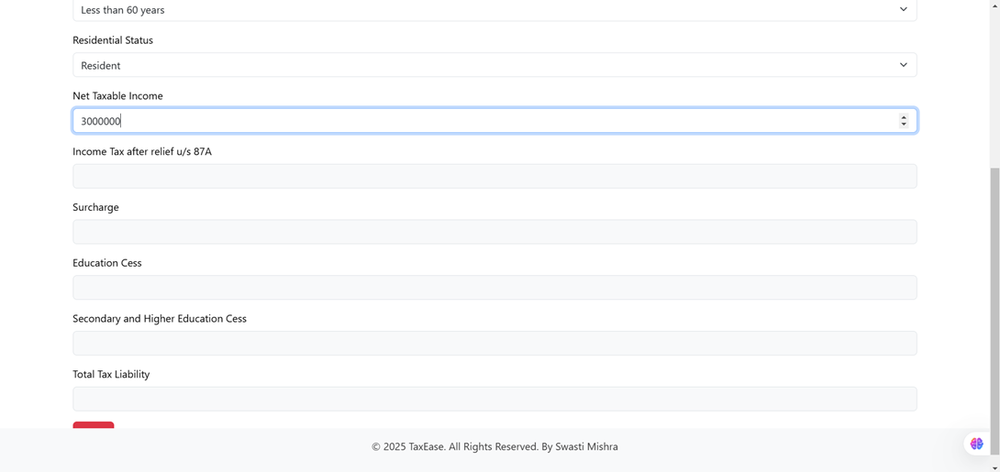
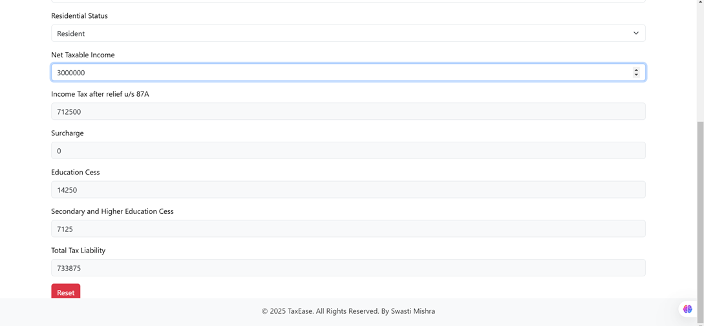
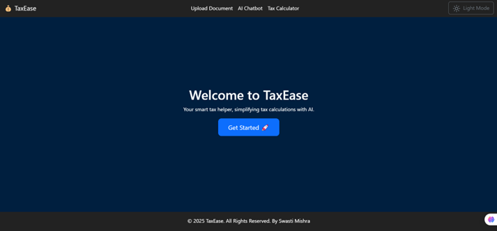

# TaxEase - AI-Powered Tax Assistant

## Overview
TaxEase is an AI-powered tax assistant designed to simplify tax filing for individuals, freelancers, and small businesses. The application leverages AI and OCR to automate document processing, provide real-time tax calculations, detect missed tax benefits, and assist users via an intelligent chatbot.

---

## Features
- **OCR-Based Document Processing**: Extracts structured data from tax documents using Google Vision API.
- **AI Chatbot**: Answers tax-related queries and provides personalized tax-saving strategies.
- **Automated Tax Calculation**: Computes tax liabilities based on user inputs.
- **Missed Tax Benefits Detector**: Identifies unclaimed deductions to maximize refunds.
- **Secure Data Storage**: Uses Firebase Firestore for encrypted storage and compliance with privacy laws.

---

## Tech Stack
### **Frontend**
- **Framework**: React.js
- **Styling**: Bootstrap, Framer Motion
- **Hosting**: Vercel

### **Backend**
- **Framework**: Node.js, Express.js
- **Database**: Firebase Firestore
- **Authentication**: Firebase Authentication
- **OCR**: Google Vision API, Tesseract.js
- **AI**: OpenAI API (Chatbot & tax guidance)
- **Hosting**: Firebase Functions

---

## Installation Guide
### **Prerequisites**
Ensure you have the following installed:
- Node.js (v16+)
- npm or yarn
- Firebase CLI
- Vercel CLI

### **Setup**
#### **1. Clone the Repository**
```sh
$ git clone https://github.com/yourusername/TaxEase.git
$ cd TaxEase
```

#### **2. Install Dependencies**
```sh
$ npm install   # or yarn install
```

#### **3. Set Up Firebase**
- Create a Firebase project
- Enable Firestore, Authentication, and Firebase Functions
- Create a `.env` file and add your Firebase credentials:
```sh
FIREBASE_API_KEY=your_api_key
FIREBASE_AUTH_DOMAIN=your_auth_domain
FIREBASE_PROJECT_ID=your_project_id
FIREBASE_STORAGE_BUCKET=your_storage_bucket
FIREBASE_MESSAGING_SENDER_ID=your_sender_id
FIREBASE_APP_ID=your_app_id
```

#### **4. Start Development Server**
```sh
$ npm start  # Runs frontend
$ npm run server  # Runs backend
```

---

## Deployment Guide
### **Deploy Frontend to Vercel**
```sh
$ vercel login
$ vercel
```
Follow the prompts to deploy.

### **Deploy Backend to Firebase Functions**
```sh
$ firebase login
$ firebase deploy --only functions
```

---

## API Endpoints
### **OCR Document Upload**
`POST /api/upload`
```json
{
  "file": "base64-encoded-image"
}
```
**Response:**
```json
{
  "status": "success",
  "extracted_data": {
    "income": 50000,
    "tax_paid": 5000
  }
}
```

### **Tax Calculation**
`POST /api/calculate`
```json
{
  "income": 50000,
  "deductions": 10000
}
```
**Response:**
```json
{
  "tax_liability": 8000
}
```

### **AI Chatbot**
`POST /api/chat`
```json
{
  "message": "How can I save taxes?"
}
```
**Response:**
```json
{
  "reply": "You can save taxes by investing in 80C instruments like PPF, ELSS, and LIC policies."
}
```

---

## Troubleshooting
**Common Issues & Fixes**
- **Firebase Error:** Ensure your Firebase credentials are correct in `.env`.
- **Vercel Deployment Issues:** Ensure you are logged in via `vercel login`.
- **OCR Not Working:** Check if the Google Vision API is enabled in your Google Cloud Console.

---

## Future Roadmap
- **Multi-region tax support** (Expand beyond India)
- **Integration with Government Portals**
- **AI-based personalized tax planning**

---

## Contributors
- **Swasti Mishra** - Lead Developer

---

## License
This project is licensed under the MIT License.

---

## References
- [Google Vision API](https://cloud.google.com/vision)
- [OpenAI API](https://openai.com/api)
- [Firebase Documentation](https://firebase.google.com/docs)

---

## Demo Link
Click here to view the first version - [demo link](https://taxease-al9uzd15j-swasti-mishras-projects.vercel.app/)

Click here to view deployment details - [link](https://vercel.com/swasti-mishras-projects/taxease/EvRimzbsxHGU7UqE6LHsjbB95nnt)

## Images


*Fig 1: Basic Landing Page – to be enhanced in next version*



*Fig 2.1: Basic Upload Page – Allows users to upload tax documents (PDFs, images). The backend processes these files using Google Vision API for OCR-based data extraction, automatically populating relevant tax fields.*



*Fig 2.2: Basic Upload Page – Depicting uploading functionality*



*Fig 3: AI Chatbot Interface – Provides real-time assistance for tax-related queries. Users can ask tax questions, get personalized tax-saving suggestions, and clarify deductions. The chatbot, powered by OpenAI's GPT, offers intelligent, context-aware responses and ensures a smooth user experience.*





*Fig 4 (combined above 3 images): Tax Calculator Page – An interactive tax calculator that allows users to input financial details using various dropdowns (e.g., income sources, deductions, exemptions, investment details). It dynamically computes tax liability and suggests tax-saving strategies based on user inputs.*



*Fig 5.1: Entering Taxable Income – Users manually enter their taxable income, including salary, business income, and other sources. The system validates inputs and ensures accuracy before proceeding*



*Fig 5.2: Calculated Tax Summary – Once the user enters the required details, the system automatically calculates total tax liability, applicable deductions, and net payable tax. It also provides insights on potential tax-saving opportunities.*



*Fig 6: Dark mode is enabled on all pages.*