# TaxEase – Effortless AI-Powered Tax Filing

[](LICENSE)
[](https://github.com/swastim01/TaxEase)

TaxEase is an innovative platform designed to simplify the tax filing process for salaried professionals, freelancers, and small business owners. By leveraging cutting-edge OCR technology and AI-driven insights, TaxEase automates data extraction, tax calculations, and provides actionable guidance—making tax season stress-free and efficient.

---

## Table of Contents

- [Overview](#overview)
- [Features](#features)
- [Architecture & Tech Stack](#architecture--tech-stack)
- [Project Structure](#project-structure)
- [Installation & Setup](#installation--setup)
- [Usage Guide](#usage-guide)
- [Contribution Guidelines](#contribution-guidelines)
- [License](#license)
- [Contact](#contact)
- [Deployment](#deployment)
- [Demo](#demo)

---

## Overview

Filing taxes is often a complex, error-prone, and time-consuming process. **TaxEase** addresses these challenges by:
- Automating document processing with OCR.
- Extracting and parsing key financial data from salary slips and invoices.
- Calculating tax liabilities based on Indian tax slabs.
- Providing an AI-powered chatbot (prototype) for tax-related queries.

TaxEase is built to help users file taxes quickly and accurately, reducing manual errors and ensuring they never miss out on potential savings.

---

## Features

- **OCR-Based Document Processing:** Extracts structured data from uploaded salary slips and invoices using [Tesseract.js](https://github.com/naptha/tesseract.js) for OCR. For PDFs, it first converts documents to images via [pdf2pic](https://github.com/yakovmeister/pdf2pic).
- **Automated Tax Calculation:** Processes salary details to compute tax liabilities according to Indian tax slabs, including standard deductions and applicable cess.
- **AI Chatbot (Prototype):** A conversational interface (currently pre-fed) that aims to offer quick tax advice and answer user queries.
- **User-Friendly Upload Interface:** A React-based interface with real-time progress indicators, file previews, and intuitive navigation.
- **Future Enhancements:**
  - **Expense Tracker:** Monitor spending and generate financial reports. *(Coming Soon)*
  - **Community Forum:** A space for sharing tax-related insights and discussing best practices. *(Coming Soon)*
  - **Multi-Language Support:** Localization for regional languages such as Hindi, Tamil, and Bengali. *(Coming Soon)*

---

## Architecture & Tech Stack

### Frontend
- **Framework:** React.js  
- **Styling:** Bootstrap, Framer Motion (for animations)  
- **Utilities:** React Spinners (for loading indicators), Lucide Icons  
- **Hosting:** Vercel  

### Backend
- **Framework:** Node.js with Express.js  
- **File Uploads:** Multer  
- **OCR & Document Conversion:**  
  - **OCR:** Tesseract.js  
  - **PDF Conversion:** pdf2pic  
- **Tax Calculation:** Custom module using regex parsing and Indian tax slabs  
- **Hosting:** Typically deployed via Firebase Functions (planned)  

### AI & Future Modules
- **AI Chatbot:** Prototype integrated with pre-fed responses (future integration with OpenAI API)
- **Database & Authentication:** Planned integration with Firebase Firestore and Firebase Authentication

---

## Project Structure

```
TaxEase/
├── client/                     # React Frontend
│   ├── public/                 # Static assets and index.html
│   ├── src/
│   │   ├── components/         # Reusable UI components (Navbar, Footer, etc.)
│   │   ├── pages/              # Main views (LandingPage, Upload, TaxCalculator, etc.)
│   │   ├── App.jsx             # Main application component with routing
│   │   └── App.css             # Global styles
│   ├── package.json            # Frontend dependencies and scripts
│   └── package-lock.json       # Dependency lockfile (npm)
│
├── server.js                   # Express Backend API routes, OCR processing, and tax calculations
├── package.json                # Backend dependencies (root package.json)
├── uploads/                    # Temporary file storage for uploads
└── README.md                   # Project Documentation

```

---

## Installation & Setup

### Prerequisites
- **Node.js** (v18 or higher recommended)
- **npm** (optional, for the frontend, v10 or higher recommended)

### Frontend Setup
1. **Clone the Repository:**
   ```bash
   git clone https://github.com/swastim01/TaxEase.git
   cd TaxEase/client
   ```
2. **Install Dependencies:**
   ```bash
   npm install --legacy-peer-deps   # or yarn install
   ```
3. **Start the Development Server:**
   ```bash
   npm start     # or yarn start
   ```
   The app will run on [http://localhost:3000](http://localhost:3000).

### Backend Setup
1. **Navigate to the root directory:**
   ```bash
   cd ~/TaxEase
   ```
2. **Install Dependencies:**
   ```bash
   npm install
   ```
3. **Start the Server:**
   ```bash
   node server.js
   ```
   The backend will run on [http://localhost:5000](http://localhost:5000).

---

## Contribution Guidelines

We welcome contributions! Follow these steps:
1. **Fork the repository.**
2. **Create a new branch:**
   ```bash
   git checkout -b feature-name
   ```
3. **Commit your changes:**
   ```bash
   git commit -m "Add new feature"
   ```
4. **Push to your fork and create a Pull Request.**

---

## License

This project is licensed under the [MIT License](LICENSE).

---

## Contact

For questions, feedback, or collaboration opportunities, please reach out:

- **Email:** [swasti.mishra0101@gmail.com](mailto:swasti.mishra0101@gmail.com)
- **GitHub:** [swastim01](https://github.com/swastim01)
- **LinkedIn:** [Swasti Mishra](https://www.linkedin.com/in/swastim01/)

---

## Deployment

### Deploying the Frontend (Vercel)
1. **Login to Vercel:**
   ```bash
   vercel login
   ```
2. **Deploy:**
   ```bash
   vercel
   ```
   Follow the prompts to complete the deployment.

### Deploying the Backend (Firebase Functions - Planned)
1. **Login to Firebase:**
   ```bash
   firebase login
   ```
2. **Deploy Functions:**
   ```bash
   firebase deploy --only functions
   ```

---

## Demo

Check out the live demo of TaxEase (note: this is just the frontend deployment link):  
[**View Demo**](https://taxease-cr98p2s4x-swasti-mishras-projects.vercel.app/)

For detailed deployment information, visit:  
[**Deployment Details**](https://vercel.com/swasti-mishras-projects/taxease/91diWnFkTKbjq4BfURKSgZEmNus6)

---

**TaxEase – Making Tax Filing Effortless & Accurate**

## Project Visuals

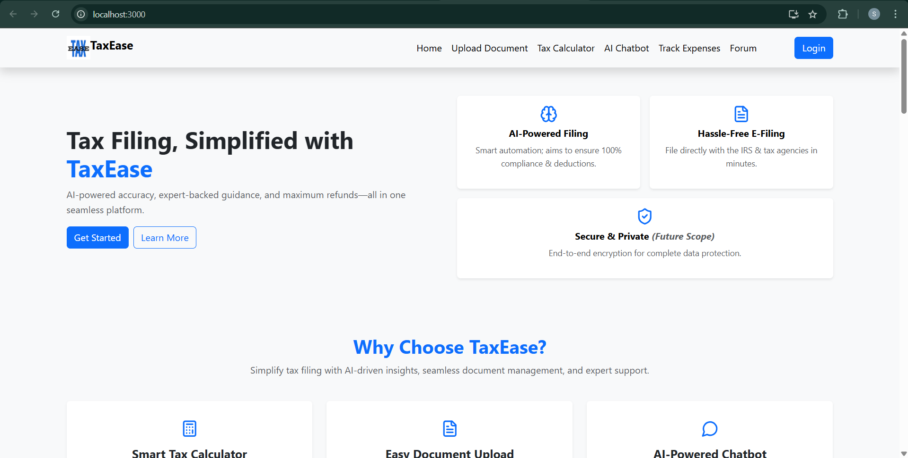

*Fig 1: The landing page displays a clean interface that introduces TaxEase and invites users to explore its core features.*  

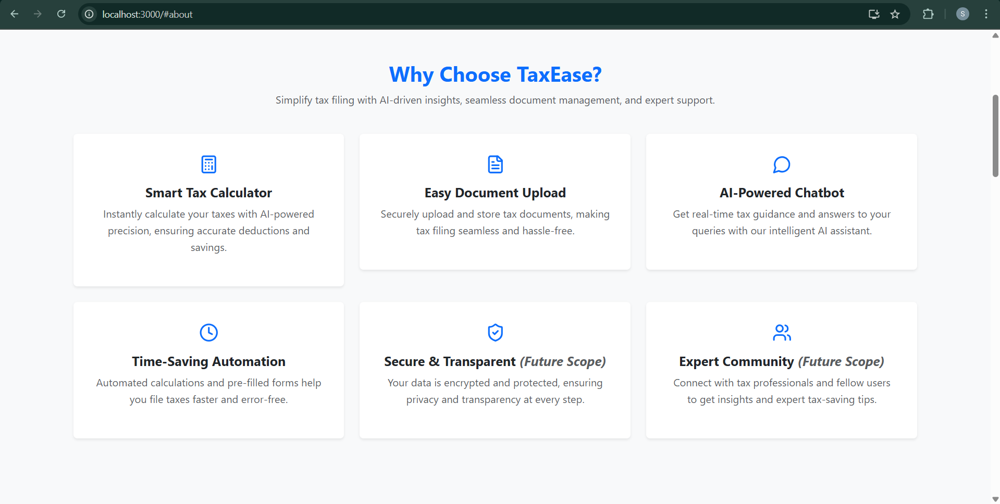

*Fig 2: The About section outlines TaxEase's mission to simplify tax filing through automation and AI-driven insights.* 

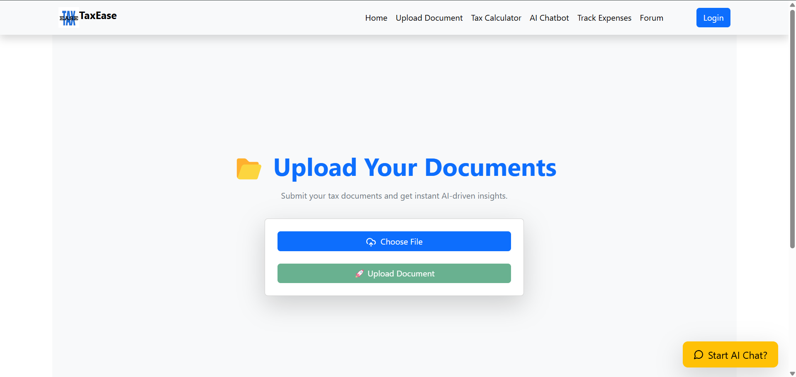

*Fig 3: The Upload Page offers an intuitive interface for users to select and upload their tax documents with ease.* 

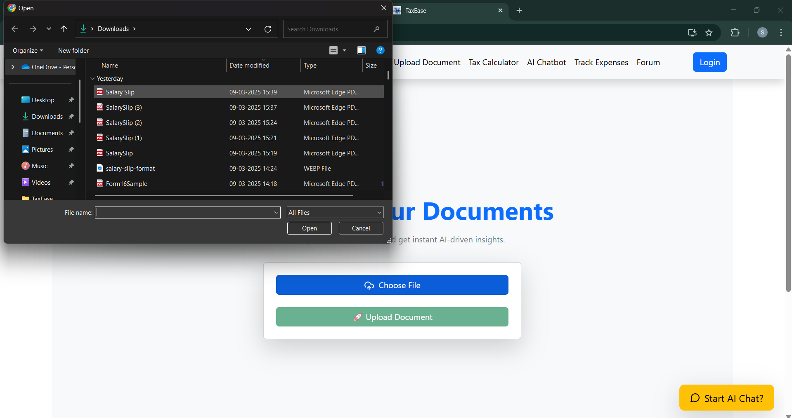

*Fig 4: The file selection screen confirms that users can choose the correct document before processing begins.*  

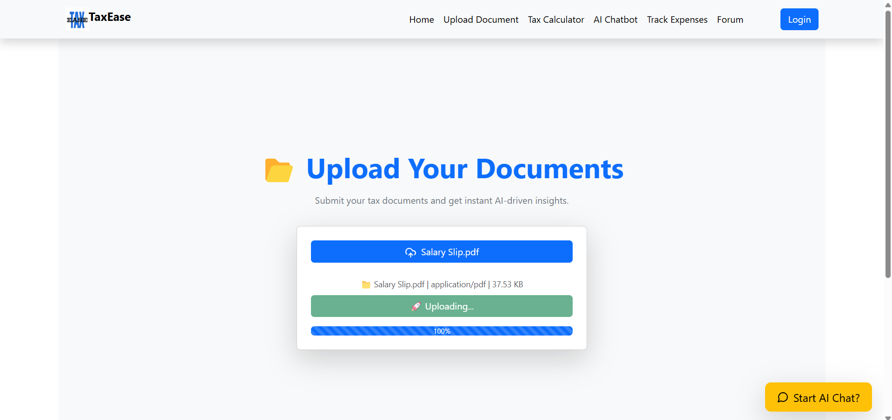

*Fig 5: This view illustrates the communication between the frontend and backend, where OCR processes the uploaded document.* 

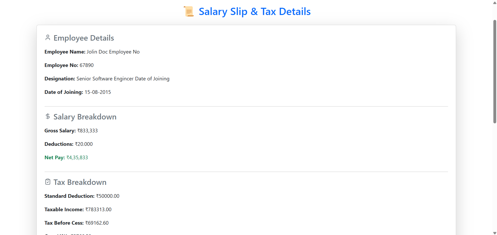

*Fig 6: The invoice generation screen provides a detailed tax invoice summarizing the extracted financial data.* 

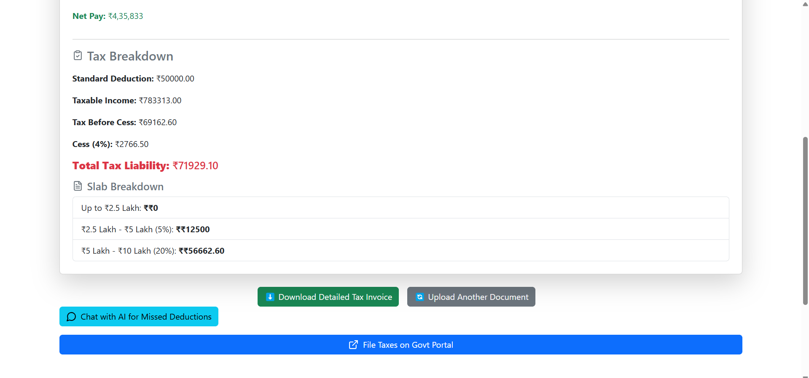

*Fig 7: The tax breakdown display clearly shows computed tax liabilities, deductions, and cess according to Indian tax slabs.*

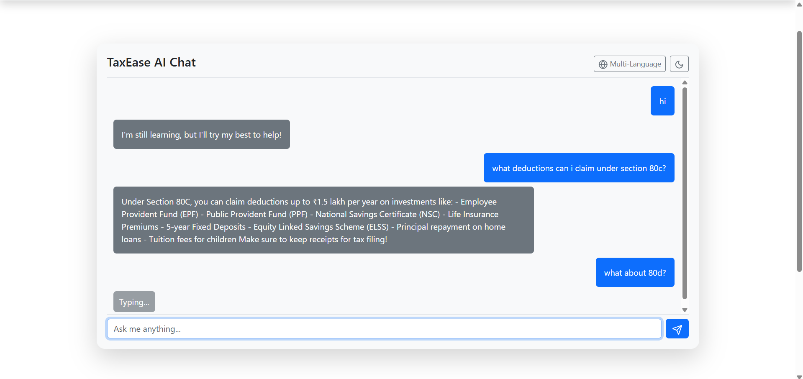

*Fig 8: The AI Chatbot interface offers instant, conversational tax guidance and answers user queries (prototype stage).* 

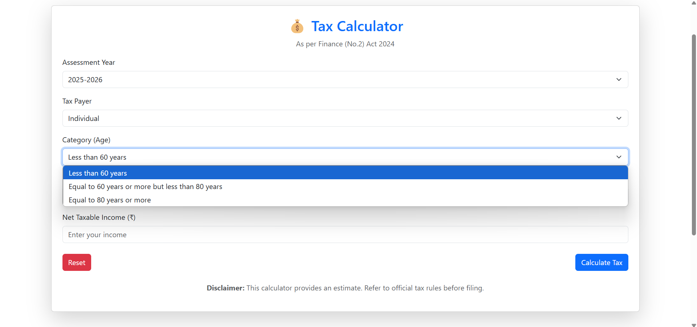

*Fig 9: The tax calculator form allows users to input their income details for personalized tax computation.*

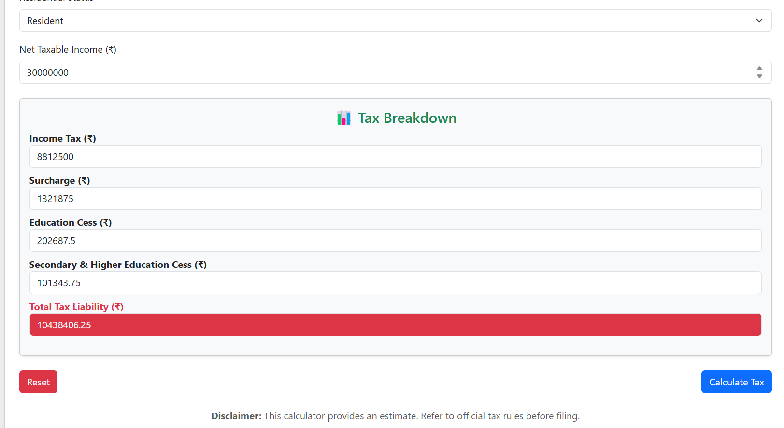

*Fig 10: The calculated details screen presents a comprehensive summary of tax computations and financial metrics.*  

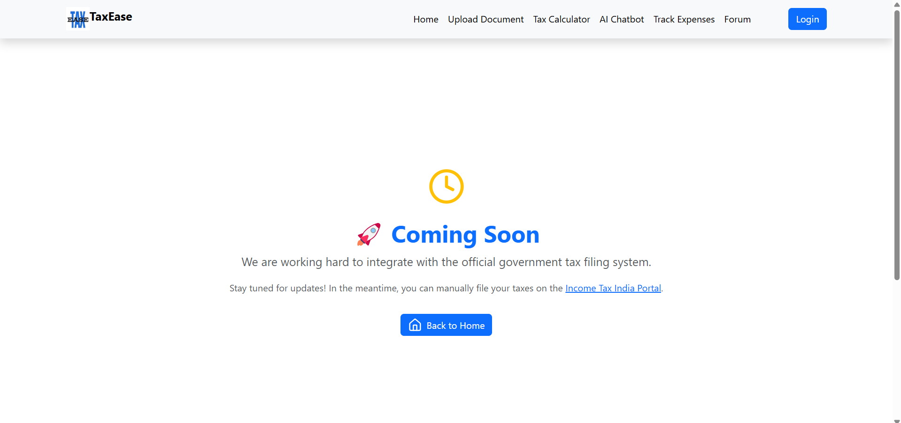

*Fig 11: Integration with the government API ensures real-time updates and accuracy in tax filing.*  

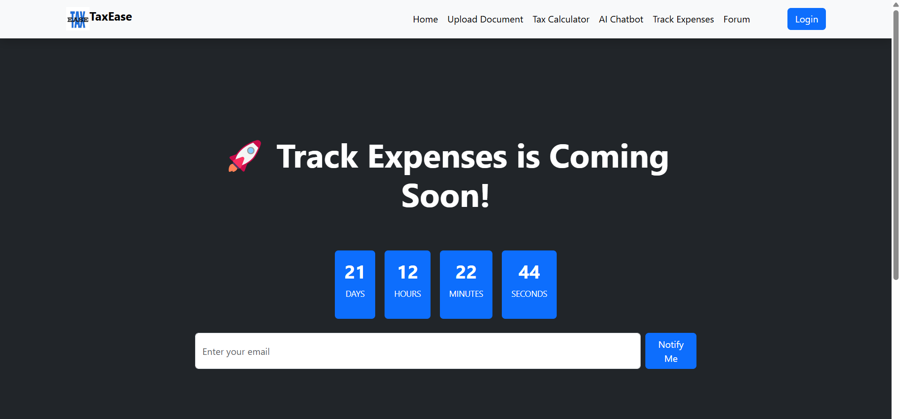

*Fig 12: The Track Expenses module (coming soon) is designed to help users monitor and manage their daily spending.* 

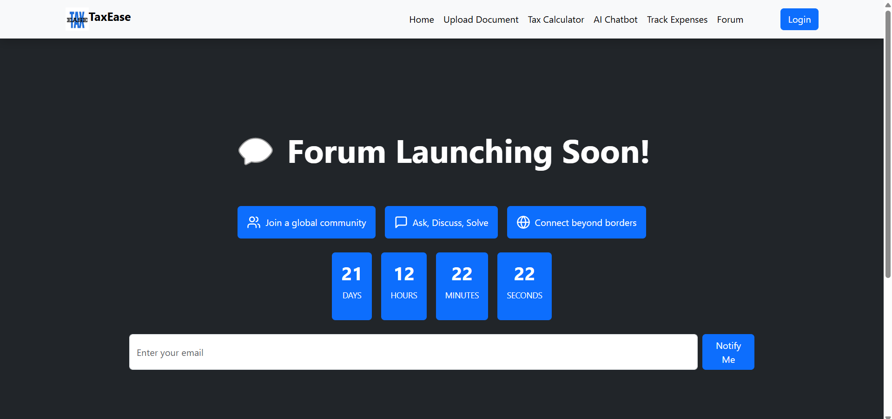

*Fig 13: The Forum (coming soon) will provide a collaborative space for sharing tax insights and discussing strategies.*

## Video displaying working prototype:

[View Video here](https://drive.google.com/file/d/1rlMLTWMV_q0vM_apn3n4rRhgzWgWAnkF/view?usp=sharing)